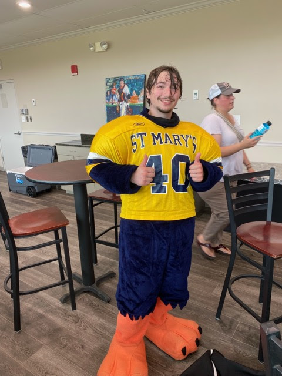
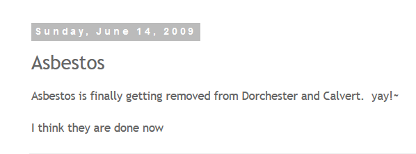
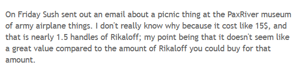
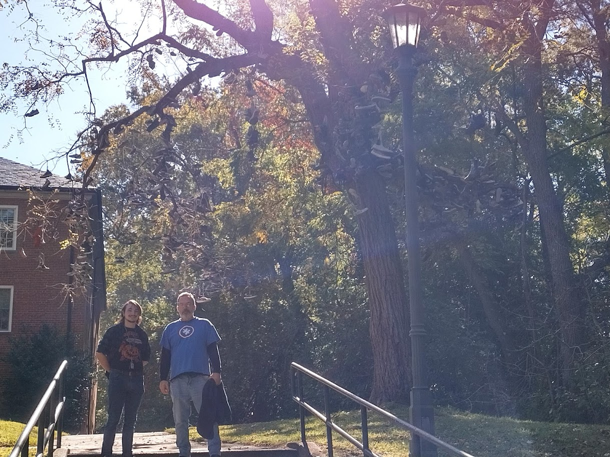
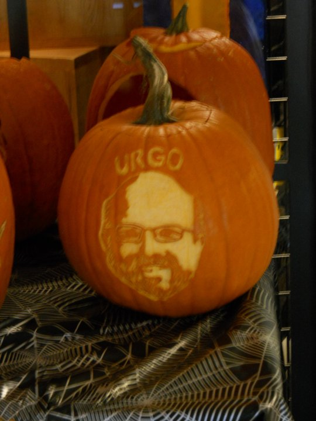

<h1>Review of SMCM LOL </h1>
<h2>"A 'student' blog about St Mary's Collge of Maryland</h2>

Dates I worked on this: 
2/22/2023 
2/23/2023 
2/24/2023 

# What is it?
[SMCMLOL](http://smcmlol.blogspot.com/) is a Blog page created on Blog spot in 2008 by a St Marys student who's online handle is Tom Seahawk, though it is later revealed that he is actually Ken Benjes. Perhaps you are an SMCM alumni reading this who went to St Mary's from 2008 to 2012 and even know him!

# Why am I talking about it
I mean partially because I felt like posting something but also because Beau showed me this little Blog a while ago, I think at the beginning of my junior year 2022, and I have finally gotten around to reading through it and there are some funny things in it. He also talks about some things, like Rikaloffs, that are still St Marys classics. Though most people I know refer to Rikaloffs as Rickies. 

# What to say
Honestly, I went into this blog with an idea but I have been writing it between classes and work and such so I actually don't quite remember what I wanted to say. I guess I'll just highlight what I thought some of the funniest posts I've found in it. And maybe just throw in some of my own experiences at St Marys

# One more thing to get to before actually getting in to the actual stuffs
Okay for one sorry that this is such a hectic thing to read lol. I was about halfway through 2009 of the blog when I decided to start writing my own little thing on it. I also would read for a bit, write a little and then go back to reading and back and forth etc. so my writing is all over the place and as you will see I've made a couple edits and maybe if some of yall make suggestions or add the SMCM lore I'll come back and make some more edits and such! Oh and if you're Ken Benjes reading this I'd love to get in contact and talk some time!!!! Maybe I'll see you next alumni weekend when I am working it! Now lets get into it.

## Green Door
Green door is the one bar very close to the college (I think there's another bar in leonardtown but that's pretty far) and a lot of the strudents here have some pretty mixed opinions of it. I have gone twice now and I'm a fan lol. First time I went on a monday when there were like 5 townies total in the bar and maybe another group of students I've recognized, me and beau shot the shit and got the Pitcher and a Pizza deal they had goin on. twas worth but also I would not reccomend going on a monday normally, it's prtty depressing lol. I got to go yesterday, a thursday, and that was pretty hype, lots of people, townies and students, and Pint night was an alright deal I think and I did some shots with ma peeps (Though I'm mad cause I bought like 2 rounds os shots, once to do it with ma peeps and the other partially cause I was simpin a lil). Anyway, tis a great time and I personally appreciate the door. But I was reading SMCMLOL and came upon a post hyping up the green door and he shared an old image of it and my god it looks like a shit hole. It still does don't get me wrong but jesus it was trash whenevert that photo was taken.  
Old Green Door:

 

New green door:

## CJ the Mascot 
Ken at some point was going through the Archives and found a picture from (93 or 87, he didn't seem so sure) and it was of CJ the Mascot. Who knows if that's what our old mascots name was or if it was the kid in the pic (probably the kid in the pic cause solomon seahawk makes way more sense than CJ the mascot). The suit looks just awful, I think SMCM really upgraded with it's new suit, which I was told is considered D1 quality lol.

Here's me (I'm Solom!) in the current suit for SMCM:

That day was so fucking hot, I chugged so many water bottles (Sorry enviroment it's all they offered me)

## LQ and Dorch
So on April 16th 2010 someone shat in the LQ kitchen and apparently the residents were banned from using said kitchen unless it's during grab and go hours and when the RAs are on duty. I love LQ so much. My freshman year (or maybe it was when I first visited, I don't remember), I was walking by LQ and a bunch of people were day drinking and doin that russian dance thing to [Rasputin](https://www.youtube.com/watch?v=eDW53rXqlRw). 

Also every fucking semester LQ desides it needs its fire Alarms to go off in the middle of the night or at some ungodly hours, when I lived there it happend 3 times one semester and either twice or again 3 times in the next. seems like Ken had the same issues lmao

Thoughout my time in Dorchester there was nothing but hate for it and I never got why (I was partially lucky cause I lived in it when there were a lot less people living there due to it being the first year of the pandemic and people never left their dorms and shizz) but like it was fun! People there were pretty friendly, and yeah it is kind of gross... but there was a sense of community, all the RA's gave minimal shit about the happenings inside and outside unless you were being a real sleezebag. I did hear that they used to have carpeting in dorch which must have been god awful oml. Anyway I found another classy post about dorch among his posts  

Some more Dorch Love

## Rickies Rickies Rickies
Mentioned it earlier but he has a couple posts where he mentions rickaloffs and it just makes my day that the residents of St marys College of Maryland in 2010 were on the Rickies grind. Though whenever I mention rickies to people here there is some looks that I get so maybe not everyone was on the grind. Anyway I don't really have much to say on this topic, he said once that he googles Rickaloffs monthly and that he found this photo, which I will now share, of people dressed in a Rickies and Natty Boh costume. Both of which are classic Baltimore drinks. Oh also one of the st Mary's traditions is the Natty Boh hunt and I just ran into a post where he found on the st Marys wikipedia mentions of said hunt. 
Here's the Pic!
 
Ken also had a clear understanding of the eonomic benefits of this lovely drink

## SMCM Oral Tradition 
In May of 2010 Ken Benjes makes a post titled ["SMCM-oral-traditions"](http://smcmlol.blogspot.com/2010/05/smcm-oral-tradition.html) and asks his readers to post some stories they've heard around campus. I went into this one kind of excited because freshman year I came to this college with a bunch of stories from my roomates sister who was going here at the time, (side note me and [Hayden](../Roomie.md) still goin strong as roomies, year three now bb), alot of which were related to how disgusting Dorchester hall, the all boys dorm, was. One was her freshman year I think a helicopter had to be called in because PS, public safety, was chasing someone who I guess was pretty trashed and he ran into the bathroom on the second floot and locked it. And I guess Didn't realise how high up he was because he jumped out and broke his leg. There were also stories of this one dude going to the the gender neutral bathrooms and absolutely nuking it for the next hour. I'm sure there were actual other ones that were funnier but I can't remember any right now, maybe I'll ask Hayden later and edit this or reach out to his sister and see if she remembers any good ones from her freshman year. Okay well point is I went into this post excited to hear some other ones but most of the comments were about this person hanging themself or some other jumping off a bridge. It was kind of depressing. There was one about how in the 70s all the jazz kids on their trip to some college were smoking on the bus and the conductor only told them to stop whenever they got to a toll booth which was pretty funny I spose. Oh Another story I heard my freshman year was that Michael Dunn, previously the head of title 9 and now the head of the Core P program (I fucking hate the core P shit), was doing a wrap in one of the dorms and got on top of a table and half way through it broke and he fell.  
Edit:
 
I actually completely forgot about this one but then I continued reading his other posts (There's so god damn may and I'm only in 2010 out of the 13 years he's been posting). So I worked Saferide for a while and over the summer I was asked t ocome down for Alumni weekend to drive people back and forth from the green door and alot of the Alumni were really nice and funny (and tipped well), sorry I was remembering it and it really was a great 3 days I spent working it. Anyway one of the guys talked about how there were riots on the greens at some point and a bunch of the Lax bros used their LAcrosse sticks to throw tear gas(or whatever shit cops were throwing at them) back at the cops, so pretty based of the Lax bros.  
If you're an SMCM broski reading this please reach out to me and let me know if you had any good stories or traditions you heard about throughout your time at SMCM!

### Shoe Tree
Not really an oral tradtion but one of our classic St Marys traditions is the Shoe tree. My understanding is that it started out as someones SMP or Art project in the 80s I think, and it sort of evolved in to a couple different things. It started out as when you did something for the first time on campus you are supposed to throw a pair of shoes up onto its branches. I think it also was at some point you were supposed to throw a pair up there for luck (that was the tour guide answer I got when I first toured the college lol) but it has evolved and seems like the traditions got mixed and is now supposed to be the first time you [get lucky](https://www.urbandictionary.com/define.php?term=get%20lucky) on campus you and the other person go the the shoe tree and throw a pair of shoes up onto one of the branches. I purposely brought home an old pair of shoes sitting around in my closet when I came back from break cause I sure as hell wasn't going to lose my only other pair of shoes. I remember it took my roomate like 30 fucking tries to get his god damn pair up there, I'm sure the Dorch 1st left basement residents loved us yelling at him at 2am.  
Also Also, I started talking about the shoe tree because one of his posts Ken said that a branch of the shoe tree fell and that's just such an L. Apparently some hero was throwing peoples shoes back up their. Where's the memorial for that guy. 
Old Picture of the Shoe tree:

Here's a pic of me and my uncle in front of it:

Edit: 
 
So when googlin the images I found a site talking about it a lil more. I guess it was a way for graduating seniors to leave a part of themselves behind on campus by throwing their shoes up there. Here's a lil [website](https://smcmchangingtides.weebly.com/preface.html) talking about some neat stuff around campus/where I found the [shoe tree](https://smcmchangingtides.weebly.com/the-shoe-tree.html) info (If you click on the photos it sends you to another page talking about it)  

Edit 2: 
 

I [found](http://smcmlol.blogspot.com/2014/06/history-of-shoe-tree.html) another post on Blogspot talking about the history of the shoe tree, he actually goes in depth with it which is nice. The link he has to this girls smp which was investigating the history of it doesn't work anymore sadly and I don't really feel like finding it myself, I can ask Beau later cause I vaguely remember him finding information on this himself.  
Just read through his version of the shoe tree lore, he left some very vague descriptions but still I appreciated a little bit more lore of it and one the comments on the post was neat so still def check it out. 

## Random Thoughts and Pics
The JURGO PUMPKIN! Joe Urgo was the president of St Marys for a while, you can figure out for how long yourself. Apparently he was pretty popular among the student pop and I guess someone made  Jurgo Pumpkin

Apparently his birthday is on January 30th, making him an Aquarius! Aquarius Joes rise up. 
Seems like Ken was a Point news Competitor lol, very based though the Point news has outlived his Blog site so maybe they won... Don't worry Ken I will avenge you when I create the Daly News podcast
[SMCM LOL vs the Point News](http://smcmlol.blogspot.com/2011/03/smcm-lol-vs-point-news.html) 

Campus Pub Opened in 2011 apparently, I never knew. The Alcohol aspect never survived though, we don't have it anymore D= . It's also kind of sad because he made it seem like the whole point was for professors to come in and eat and drink with students but I know that really doesn't happen ever (atleast not in the 3 years that i've been here) which is sad. 
Apparently Benje found a [Glass Rickies Bottle](http://smcmlol.blogspot.com/2011/12/glass-rikki-genuine-glass.html), I dont believe it but he took the shittiest photo of it so who knows. Anyway one of the comments was an absolute banger. "A gold plated turd is still a turd" 

A pretty popular Slogan on Campus is Keep St Marys weird, and I guess it got started around 2013? Anyway Tom seahawk is a hater and has made 2 posts (so far as I've read) about not liking it and I think they're just a hater. Also is the Tom Seahawk account ran by two people now? Or is it still Just Ken? 

I think I mentioned it somewhere earlier in the post but I rarely see nothing but hate for Baltimore and it's nice to see Ken giving it some love in this [post](http://smcmlol.blogspot.com/2014/07/baltimore.html) 
SMCM MINECRAFT!!!! Someone made the campus center in minecrafter apparently! [Pretty Cool](http://smcmlol.blogspot.com/2014/09/smcm-in-minecraft.html) 

[back](../)

